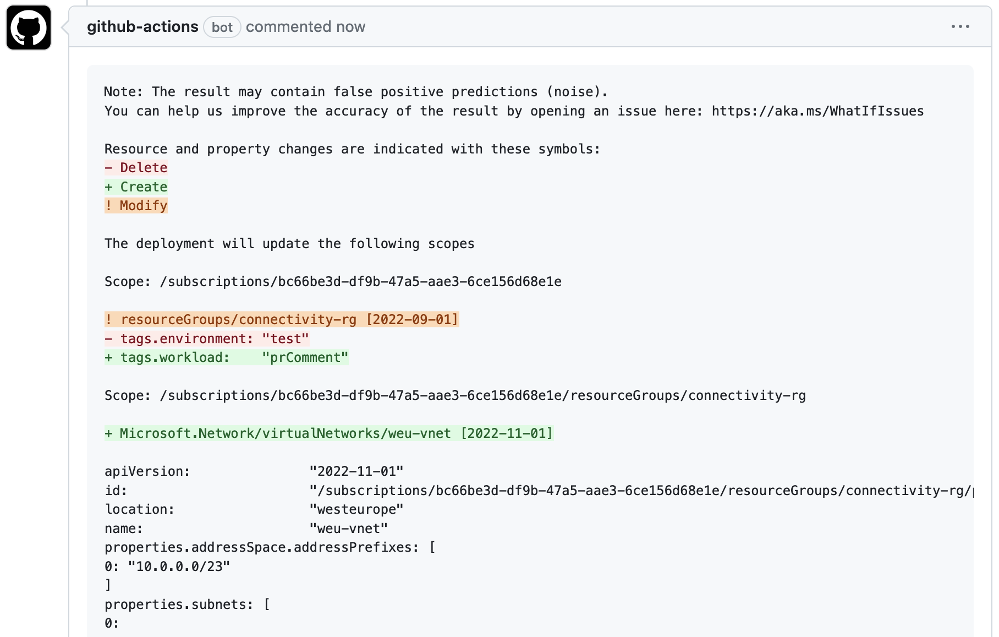

# Pull Request comment with what-if content

A short template and guide on how to set up a pipeline that pushes a comment on a pull request with what-if content from the preview step using following az cli command: az deployment sub what-if.

## Table of Contents

1. [Prerequisites](#prerequisites)
2. [Pipeline](#pipeline)
3. [Colorize](#colorize)
4. [Sample](#sample)

## Prerequisites

- SPN with permissions to an Azure subscription
- Github: Repo secrets, allow github actions to create PR

## Pipeline

I have created a pipeline with three steps:

- Lint - This step i using the Bicep linter tool, that analyzes the Bicep code to surface issues. It enforces a set of style and quality rules, and it's a way to catch common errors and ensure your code adheres to best practices. The command az bicep build --file main.bicep checks the Bicep file for any syntax errors or violations of best practices.
- Validate - Using the arm-deploy function, this determines how the deployment is carried out. When set to Validate, the Azure Resource Manager will only validate the template and won't deploy any resources. It checks the template for syntactical correctness and validates the inputs, but it doesn't ensure that the resources defined in the template will be created successfully.
- Preview - This job depends on the successful completion of the lint and validate jobs, as indicated by needs. It then logs in to azure using federated credentials. Se more details here: "LINK". It then runs a 'what-if' analysis on the deployment, which provides a preview of what changes would happen if the deployment were to be executed. The results of this analysis are formatted and commented on the pull request using the gh pr comment command. The commenting requires a GitHub token, which is accessed from the repository secrets as GITHUB_TOKEN.

## Colorize

The markdown fileformat has its limitations of customization and formatting, but there is a way to add colors to the what-if results when publishing the content as comment in the pull request. In order to accomplish that, we need to format the what-if results using a couple of commands. In short we format the output to be a codesnippet using ``` and do a couple of changes to the output file:

Replace every tilde ("~") in the file results.md with an exclamation mark ("!"). The 's' specifies substitute command, the '/' are delimiters, the 'g' at the end is for global replacement (replace all and not just the first instance)

- Command: *sed 's/~/!/g'*

Removes leading whitespace (spaces and tabs) from each line. The '^' is the start of the line, '[ \t]*' matches any number of spaces or tabs.

- Command: *sed 's/^[ \t]*//'*

## Sample


